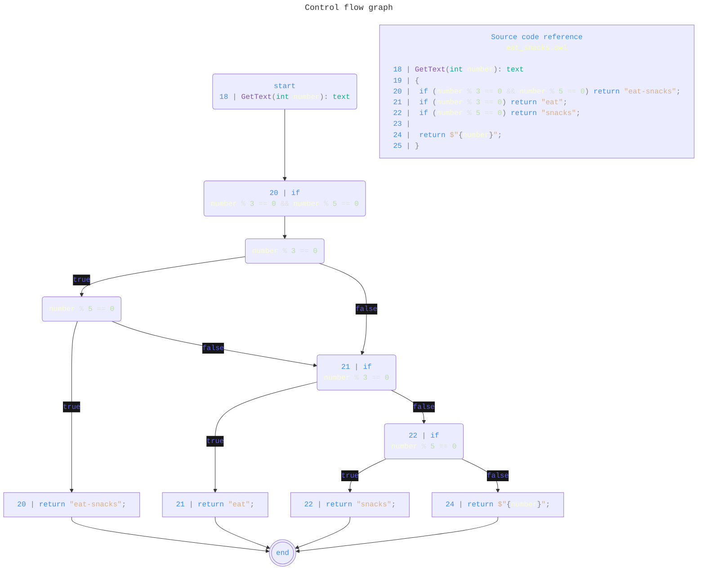

# Control flow graph

This is a
[mermaid](https://mermaid.ai)
control flow graph for the `GetText` function, in the
[`eat_snacks.owl`](../src/examples/eat_snacks.owl) example file.

```mermaid
---
title: Control flow graph
config:
  themeVariables:
    darkMode: true
    fontFamily: 'Droid Sans Mono, monospace'
    edgeLabelBackground: '#171717'
---
flowchart TB;
  %% Special blocks
  start_node#0("<div style="white-space:pre;text-align:center;tab-size:3"><span style="color:#3D8DE9">start</span></div><div style="white-space:pre;text-align:left;tab-size:3"><span style="color:#3D8DE9">18</span><span style="color:#D7D7D7"> </span><span style="color:#808080">|</span><span style="color:#D7D7D7"> </span><span style="color:#8054AF">GetText</span><span style="color:#808080">(</span><span style="color:#00AF87">int</span><span style="color:#D7D7D7"> </span><span style="color:#FCFFCC">number</span><span style="color:#808080">)</span><span style="color:#808080">:</span><span style="color:#D7D7D7"> </span><span style="color:#00AF87">text</span></div>")
  end_node#12((("<div style="white-space:pre;text-align:center;tab-size:3"><span style="color:#3D8DE9">end</span></div>")))

  %% Unconditional branches
  value_return_statement#2 --> end_node#12
  if_statement#1 --> binary_expression#3
  value_return_statement#6 --> end_node#12
  value_return_statement#9 --> end_node#12
  value_return_statement#11 --> end_node#12
  start_node#0 --> if_statement#1

  %% Conditional branches
  binary_expression#3 -->|"<span style="color:#5E5EE1">true</span>"|binary_expression#4
  binary_expression#3 -->|"<span style="color:#5E5EE1">false</span>"|binary_expression#7
  binary_expression#4 -->|"<span style="color:#5E5EE1">true</span>"|value_return_statement#2
  binary_expression#4 -->|"<span style="color:#5E5EE1">false</span>"|binary_expression#7
  binary_expression#7 -->|"<span style="color:#5E5EE1">true</span>"|value_return_statement#6
  binary_expression#7 -->|"<span style="color:#5E5EE1">false</span>"|binary_expression#10
  binary_expression#10 -->|"<span style="color:#5E5EE1">true</span>"|value_return_statement#9
  binary_expression#10 -->|"<span style="color:#5E5EE1">false</span>"|value_return_statement#11

  %% Expressions
  binary_expression#3("<div style="white-space:pre;text-align:left;tab-size:3"><span style="color:#FCFFCC">number</span><span style="color:#D7D7D7"> </span><span style="color:#E0E0E0">%</span><span style="color:#D7D7D7"> </span><span style="color:#B8DEA4">3</span><span style="color:#D7D7D7"> </span><span style="color:#E0E0E0">==</span><span style="color:#D7D7D7"> </span><span style="color:#B8DEA4">0</span></div>")
  binary_expression#4("<div style="white-space:pre;text-align:left;tab-size:3"><span style="color:#FCFFCC">number</span><span style="color:#D7D7D7"> </span><span style="color:#E0E0E0">%</span><span style="color:#D7D7D7"> </span><span style="color:#B8DEA4">5</span><span style="color:#D7D7D7"> </span><span style="color:#E0E0E0">==</span><span style="color:#D7D7D7"> </span><span style="color:#B8DEA4">0</span></div>")
  binary_expression#7("<div style="white-space:pre;text-align:center;tab-size:3"><span style="color:#3D8DE9">21</span><span style="color:#D7D7D7"> </span><span style="color:#808080">|</span><span style="color:#D7D7D7"> </span><span style="color:#3D8DE9">if</span></div><div style="white-space:pre;text-align:left;tab-size:3"><span style="color:#FCFFCC">number</span><span style="color:#D7D7D7"> </span><span style="color:#E0E0E0">%</span><span style="color:#D7D7D7"> </span><span style="color:#B8DEA4">3</span><span style="color:#D7D7D7"> </span><span style="color:#E0E0E0">==</span><span style="color:#D7D7D7"> </span><span style="color:#B8DEA4">0</span></div>")
  binary_expression#10("<div style="white-space:pre;text-align:center;tab-size:3"><span style="color:#3D8DE9">22</span><span style="color:#D7D7D7"> </span><span style="color:#808080">|</span><span style="color:#D7D7D7"> </span><span style="color:#3D8DE9">if</span></div><div style="white-space:pre;text-align:left;tab-size:3"><span style="color:#FCFFCC">number</span><span style="color:#D7D7D7"> </span><span style="color:#E0E0E0">%</span><span style="color:#D7D7D7"> </span><span style="color:#B8DEA4">5</span><span style="color:#D7D7D7"> </span><span style="color:#E0E0E0">==</span><span style="color:#D7D7D7"> </span><span style="color:#B8DEA4">0</span></div>")

  %% Statements
  value_return_statement#2["<div style="white-space:pre;text-align:left;tab-size:3"><span style="color:#3D8DE9">20</span><span style="color:#D7D7D7"> </span><span style="color:#808080">|</span><span style="color:#D7D7D7"> </span><span style="color:#3D8DE9">return</span><span style="color:#D7D7D7"> </span><span style="color:#D7AF87">&quot;</span><span style="color:#D7AF87">eat-snacks</span><span style="color:#D7AF87">&quot;</span><span style="color:#808080">&#x3b;</span></div>"]
  value_return_statement#6["<div style="white-space:pre;text-align:left;tab-size:3"><span style="color:#3D8DE9">21</span><span style="color:#D7D7D7"> </span><span style="color:#808080">|</span><span style="color:#D7D7D7"> </span><span style="color:#3D8DE9">return</span><span style="color:#D7D7D7"> </span><span style="color:#D7AF87">&quot;</span><span style="color:#D7AF87">eat</span><span style="color:#D7AF87">&quot;</span><span style="color:#808080">&#x3b;</span></div>"]
  value_return_statement#9["<div style="white-space:pre;text-align:left;tab-size:3"><span style="color:#3D8DE9">22</span><span style="color:#D7D7D7"> </span><span style="color:#808080">|</span><span style="color:#D7D7D7"> </span><span style="color:#3D8DE9">return</span><span style="color:#D7D7D7"> </span><span style="color:#D7AF87">&quot;</span><span style="color:#D7AF87">snacks</span><span style="color:#D7AF87">&quot;</span><span style="color:#808080">&#x3b;</span></div>"]
  value_return_statement#11["<div style="white-space:pre;text-align:left;tab-size:3"><span style="color:#3D8DE9">24</span><span style="color:#D7D7D7"> </span><span style="color:#808080">|</span><span style="color:#D7D7D7"> </span><span style="color:#D7D7D7"></span><span style="color:#3D8DE9">return</span><span style="color:#D7D7D7"> </span><span style="color:#D7AF87">$&quot;</span><span style="color:#808080">{</span><span style="color:#FCFFCC">number</span><span style="color:#808080">}</span><span style="color:#D7AF87">&quot;</span><span style="color:#808080">&#x3b;</span></div>"]

  %% Constructs
  if_statement#1("<div style="white-space:pre;text-align:center;tab-size:3"><span style="color:#3D8DE9">20</span><span style="color:#D7D7D7"> </span><span style="color:#808080">|</span><span style="color:#D7D7D7"> </span><span style="color:#3D8DE9">if</span></div><div style="white-space:pre;text-align:left;tab-size:3"><span style="color:#FCFFCC">number</span><span style="color:#D7D7D7"> </span><span style="color:#E0E0E0">%</span><span style="color:#D7D7D7"> </span><span style="color:#B8DEA4">3</span><span style="color:#D7D7D7"> </span><span style="color:#E0E0E0">==</span><span style="color:#D7D7D7"> </span><span style="color:#B8DEA4">0</span><span style="color:#D7D7D7"> </span><span style="color:#E0E0E0">&amp;&amp;</span><span style="color:#D7D7D7"> </span><span style="color:#FCFFCC">number</span><span style="color:#D7D7D7"> </span><span style="color:#E0E0E0">%</span><span style="color:#D7D7D7"> </span><span style="color:#B8DEA4">5</span><span style="color:#D7D7D7"> </span><span style="color:#E0E0E0">==</span><span style="color:#D7D7D7"> </span><span style="color:#B8DEA4">0</span></div>")

  %% Source code reference
  source_code_reference["<div style="white-space:pre;text-align:center;tab-size:3"><span style="color:#3D8DE9">Source code reference</span>
<span style="color:#FAFFB0">eat_snacks.owl</span></div>
<div style="white-space:pre;text-align:left;tab-size:3"><span style="color:#3D8DE9">18</span><span style="color:#D7D7D7"> </span><span style="color:#808080">|</span><span style="color:#D7D7D7"> </span><span style="color:#8054AF">GetText</span><span style="color:#808080">(</span><span style="color:#00AF87">int</span><span style="color:#D7D7D7"> </span><span style="color:#FCFFCC">number</span><span style="color:#808080">)</span><span style="color:#808080">:</span><span style="color:#D7D7D7"> </span><span style="color:#00AF87">text</span>
<span style="color:#3D8DE9">19</span><span style="color:#D7D7D7"> </span><span style="color:#808080">|</span><span style="color:#D7D7D7"> </span><span style="color:#808080">{</span>
<span style="color:#3D8DE9">20</span><span style="color:#D7D7D7"> </span><span style="color:#808080">|</span><span style="color:#D7D7D7"> </span><span style="color:#D7D7D7">	</span><span style="color:#3D8DE9">if</span><span style="color:#D7D7D7"> </span><span style="color:#808080">(</span><span style="color:#FCFFCC">number</span><span style="color:#D7D7D7"> </span><span style="color:#E0E0E0">%</span><span style="color:#D7D7D7"> </span><span style="color:#B8DEA4">3</span><span style="color:#D7D7D7"> </span><span style="color:#E0E0E0">==</span><span style="color:#D7D7D7"> </span><span style="color:#B8DEA4">0</span><span style="color:#D7D7D7"> </span><span style="color:#E0E0E0">&amp;&amp;</span><span style="color:#D7D7D7"> </span><span style="color:#FCFFCC">number</span><span style="color:#D7D7D7"> </span><span style="color:#E0E0E0">%</span><span style="color:#D7D7D7"> </span><span style="color:#B8DEA4">5</span><span style="color:#D7D7D7"> </span><span style="color:#E0E0E0">==</span><span style="color:#D7D7D7"> </span><span style="color:#B8DEA4">0</span><span style="color:#808080">)</span><span style="color:#D7D7D7"> </span><span style="color:#3D8DE9">return</span><span style="color:#D7D7D7"> </span><span style="color:#D7AF87">&quot;</span><span style="color:#D7AF87">eat-snacks</span><span style="color:#D7AF87">&quot;</span><span style="color:#808080">&#x3b;</span>
<span style="color:#3D8DE9">21</span><span style="color:#D7D7D7"> </span><span style="color:#808080">|</span><span style="color:#D7D7D7"> </span><span style="color:#D7D7D7">	</span><span style="color:#3D8DE9">if</span><span style="color:#D7D7D7"> </span><span style="color:#808080">(</span><span style="color:#FCFFCC">number</span><span style="color:#D7D7D7"> </span><span style="color:#E0E0E0">%</span><span style="color:#D7D7D7"> </span><span style="color:#B8DEA4">3</span><span style="color:#D7D7D7"> </span><span style="color:#E0E0E0">==</span><span style="color:#D7D7D7"> </span><span style="color:#B8DEA4">0</span><span style="color:#808080">)</span><span style="color:#D7D7D7"> </span><span style="color:#3D8DE9">return</span><span style="color:#D7D7D7"> </span><span style="color:#D7AF87">&quot;</span><span style="color:#D7AF87">eat</span><span style="color:#D7AF87">&quot;</span><span style="color:#808080">&#x3b;</span>
<span style="color:#3D8DE9">22</span><span style="color:#D7D7D7"> </span><span style="color:#808080">|</span><span style="color:#D7D7D7"> </span><span style="color:#D7D7D7">	</span><span style="color:#3D8DE9">if</span><span style="color:#D7D7D7"> </span><span style="color:#808080">(</span><span style="color:#FCFFCC">number</span><span style="color:#D7D7D7"> </span><span style="color:#E0E0E0">%</span><span style="color:#D7D7D7"> </span><span style="color:#B8DEA4">5</span><span style="color:#D7D7D7"> </span><span style="color:#E0E0E0">==</span><span style="color:#D7D7D7"> </span><span style="color:#B8DEA4">0</span><span style="color:#808080">)</span><span style="color:#D7D7D7"> </span><span style="color:#3D8DE9">return</span><span style="color:#D7D7D7"> </span><span style="color:#D7AF87">&quot;</span><span style="color:#D7AF87">snacks</span><span style="color:#D7AF87">&quot;</span><span style="color:#808080">&#x3b;</span>
<span style="color:#3D8DE9">23</span><span style="color:#D7D7D7"> </span><span style="color:#808080">|</span><span style="color:#D7D7D7"> </span>
<span style="color:#3D8DE9">24</span><span style="color:#D7D7D7"> </span><span style="color:#808080">|</span><span style="color:#D7D7D7"> </span><span style="color:#D7D7D7">	</span><span style="color:#3D8DE9">return</span><span style="color:#D7D7D7"> </span><span style="color:#D7AF87">$&quot;</span><span style="color:#808080">{</span><span style="color:#FCFFCC">number</span><span style="color:#808080">}</span><span style="color:#D7AF87">&quot;</span><span style="color:#808080">&#x3b;</span>
<span style="color:#3D8DE9">25</span><span style="color:#D7D7D7"> </span><span style="color:#808080">|</span><span style="color:#D7D7D7"> </span><span style="color:#808080">}</span></div>"]
```
