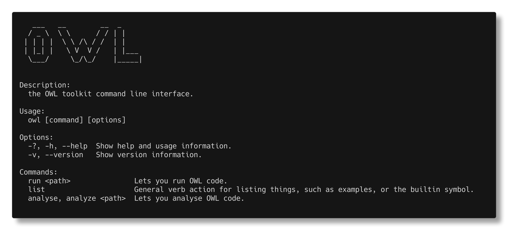
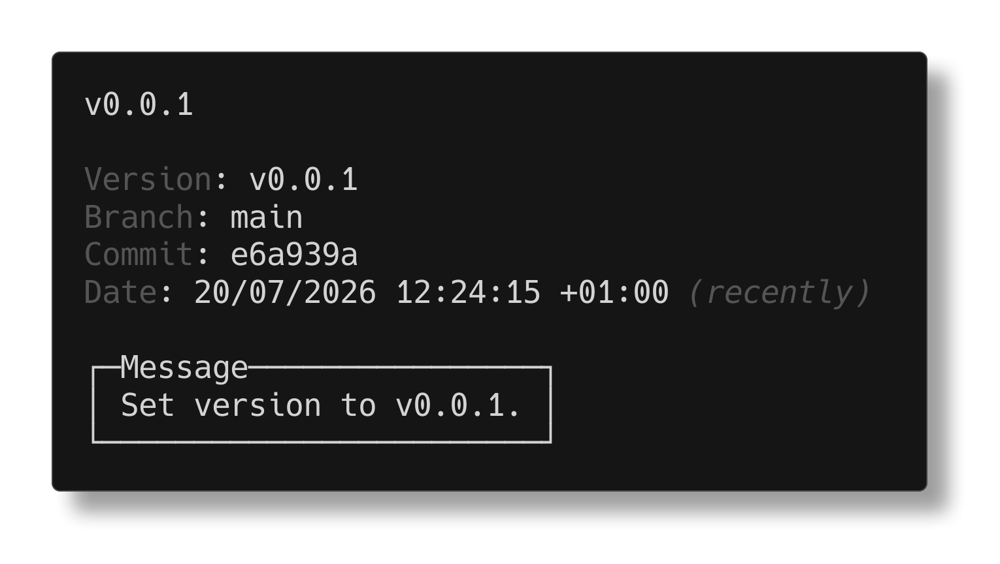
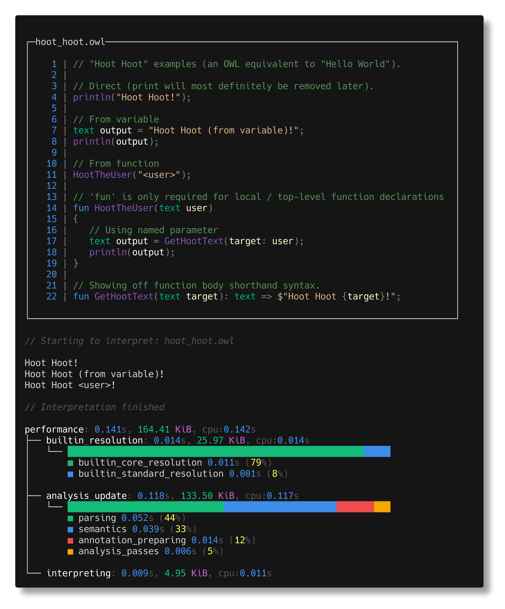
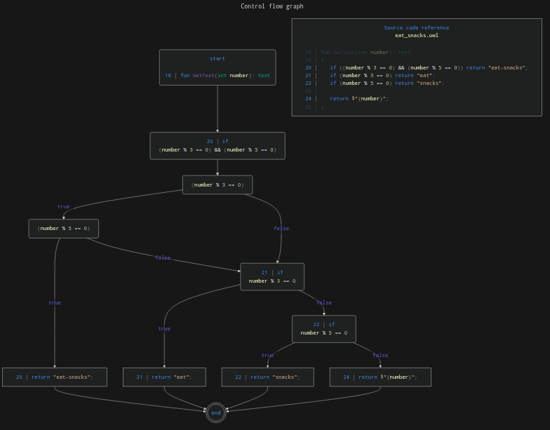

# OWL

**OWL** is an opinionated language dedicated to making it easy to create high
quality and polished user facing software, if you'd like to learn more, you can
do so by reading the
[main organisation page](https://github.com/owl-whatever-language/).

This repository will eventually be dedicated to the CLI
*(command-line interface)* for OWL, however right now it contains the entire
compiler/toolkit.

> [!WARNING]
> OWL is currently not even in alpha yet, the current version is only around
> v0.0.1. As such, expect there to be bugs, and if possible, I'd appreciate you
> informing me about them.


## Usage

Currently, the CLI can:
- Run general OWL code and interpreter it.
- Analyse a general OWL code file, as a single operation or in watch mode.
- Run the provided OWL examples and highlight them in your terminal.
- List the provided OWL examples.
- List the builtin types and functions.
- Keep track of the current OWL version.




## Download

If you'd like to download the OWL CLI, then you can do so either by downloading
the build artifacts from the
[actions](https://github.com/owl-whatever-language/cli/actions) tab *(only
visible if signed-in into GitHub).* Or you can check for the
[latest release](https://github.com/owl-whatever-language/cli/releases/latest)
and download that.

The OWL examples are provided with the download, and although the project is
currently written with .NET and C#, the CLI is AOT compiled so the .NET runtime
is not required to run it.

> [!WARNING]
> No prebuilt binaries are available for Windows, this is because Windows
> has annoyed me and is being a pain to build for, but you can attempt to do so
> yourself if you'd like to.


## Building

If you'd like to build the project yourself, then I'm assuming you know
how to clone the repository, and know some general basics about .NET. The
project currently targets .NET 10, so you'll need a compatible SDK.

Then you can either build or publish:
- The entire solution which is in the [`src`](../src/) directory.
- Just the CLI project which is in the  [`src/cli`](../src/cli/) directory.


## Versioning

If you'd like to keep track of the OWL version, then you can do so by running:
```bash
owl -v
owl --version
```

Which will look something like this:




## Examples

This repository also contains a few OWL examples, located in the
[`src/examples`](../src/examples/) directory, which are also provided with the
CLI downloads. These are currently the primary way to learn about the OWL
syntax. If you'd like to learn about the builtin types and functions, you can
run:
```bash
owl list builtins
```

If you want to look at the examples, then I recommend doing so through the CLI
by running:
```bash
owl list examples # Shows you what examples are available.
owl run example <example_name> # By default will run hoot_hoot.owl.
```
This is because the output will be syntax highlighted for you, along with having
nice error explanations if the example is purposefully showing something off:



### Control flow graphs

OWL is also capable of creating some pretty nice control flow graphs, this
functionality is not yet available from the CLI as it's a bit annoying to design
the UX for it, and so it was skipped from the v0.0.1 release.

The generated CFG looks something like this:



If you'd like an interactive graph you can move around in, or to see the
generated Mermaid code, then you can take a look at the separate
[CFG file](./cfg.md).
