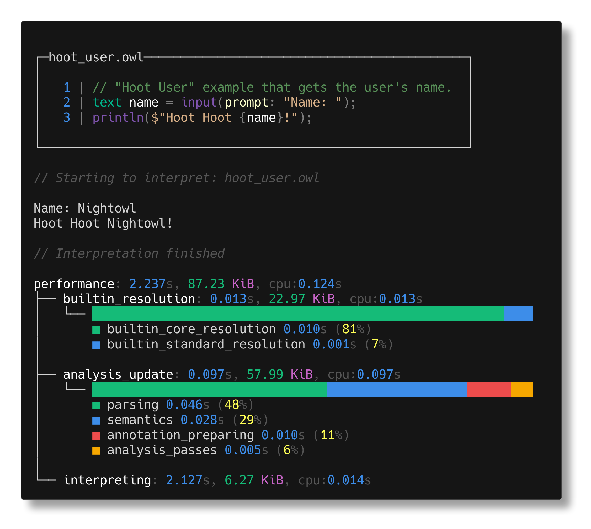
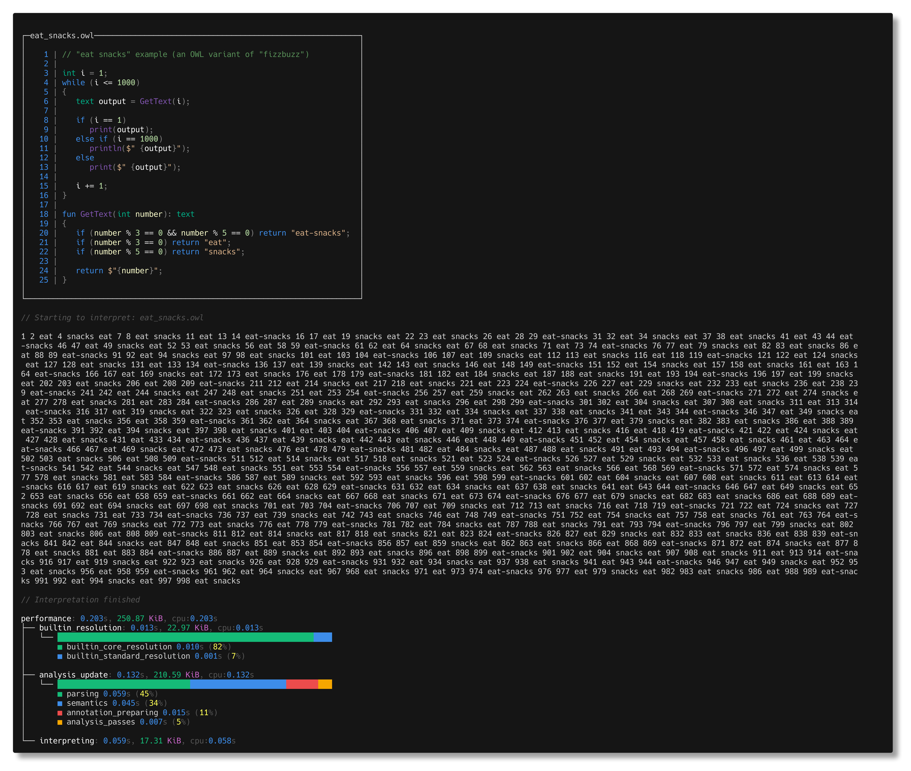

# OWL

This repository will eventually contain the overall CLI for the OWL project.
However right now, it includes the entire compiler.

## Running examples

It can't do much right now, but it can interpret the example files, which are in
the [`examples`](../src/examples) directory.

If you'd like to do so, you can run the following in the root of this repository
*(to run the [`hoot_hoot.owl`](../src/examples/hoot_hoot.owl) example)*:
```sh
dotnet run --project src/cli -- run src/examples/hoot_hoot.owl
```
This will run the example in debug mode, if you'd like to check the performance
then you should run it in release mode instead, which you can do by running:
 ```sh
dotnet run -c Release --project src/cli -- run src/examples/hoot_hoot.owl
```

The output won't be much, just the prints from the example source code.

## Nicer example previews

Since quite a bit of the output is still just for debugging, and not a part of
the main project, I think it'll be nice to show it here, just as a preview of 
what's to come.






*(These nice terminal 'screenshots' have been created with 
[termshot](https://github.com/homeport/termshot)).*

## Versions

If you'd like to keep track of the compiler's progress and versions, you can
do it with the `version` **command** *(not the flag, since I can't customise
the output of that as nicely yet).*

```sh
dotnet run --project src/cli -- version
```

Which will look something like this:


