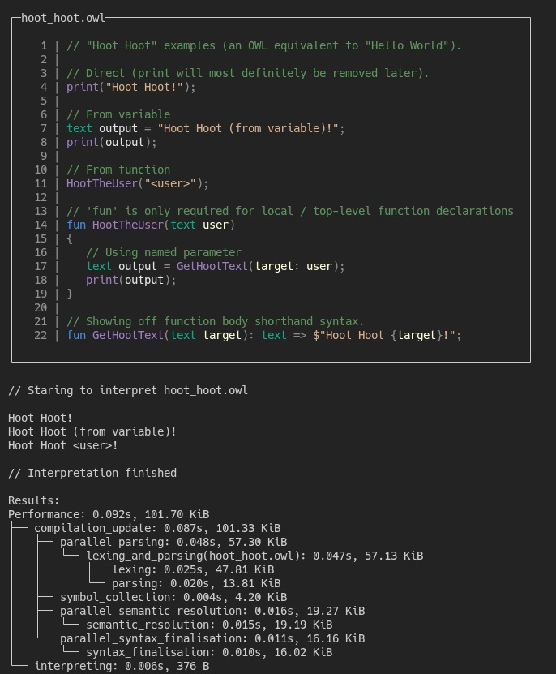

# OWL

This repository will eventually contain the overall CLI for the OWL project.
However right now, it includes the entire compiler.

It can't do much right now, but it can interpret the
[`hoot_hoot.owl`](../src/examples/hoot_hoot.owl) example.

If you'd like to do so, you can run the following in the root of this repository:
```sh
dotnet run --project src/cli/cli.csproj -- run src/examples/hoot_hoot.owl
```
The output won't be much, just the prints from the example source code.

But here's a nicer preview from some debug output:


If you'd like to keep track of the compiler's progress and versions, you can
do it with the `version` **command** *(not the flag, I can't customise that lol).*

```sh
dotnet run --project src/cli/cli.csproj -- version
```
Which will look something like this:
```
Version: 1.0.0
Branch: main
Hash: 5fbbf42 (with local changes)
Date: 22/06/2026 15:27:35 +01:00 (recently)

┌─Message────────────────┐
│ Add basic run command. │
└────────────────────────┘
```
